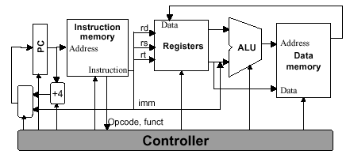

# MIPS

### Goals
* Implement non-pipelined MIPS architecture using systemverilog
* Implement also the pipelined version



### Prerequisites
* CMake
* Verilator

### Setup

```bash
mkdir build
cmake -S . -B build/
verilator --sc main.sv --top-module main --build
cd build
make
./vmain
```

### Opcodes(6bit)
* 000001: movlw ✅
* 000010: movf ❌
* 000011: jmp ❌
* 000100: ld ❌
* 000101: st ❌
* 000110: add ❌ 
* 000111: sub ❌
* 001000: mul ❌
* 001001: div ❌
